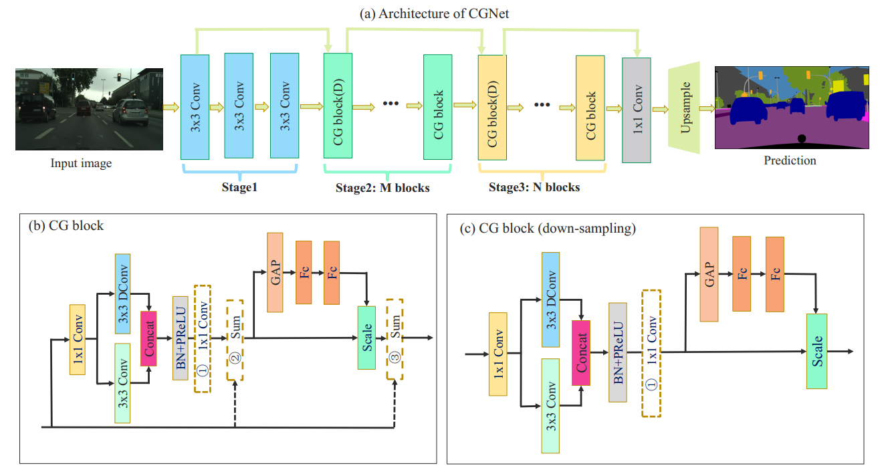
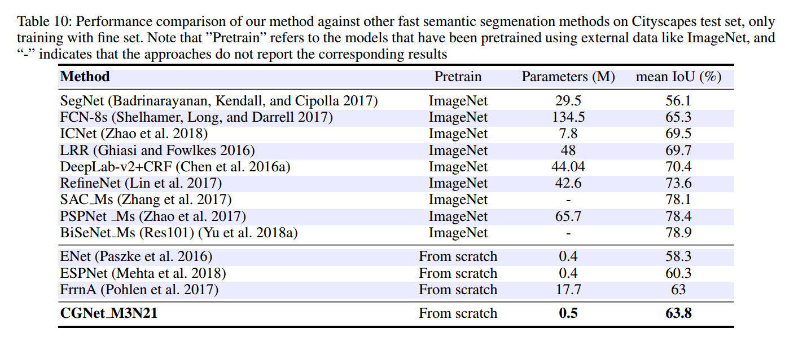

# CGNet
## Introduction
The demand of operating semantic segmentation model on mobile devices has been increasing rapidly. Current
state-of-the-art segmentation networks are transferred from large image classification networks, so that they have enor-
mous memory footprint and are unsuitable for mobile devices. There are also some segmentation models with a
low memory footprint, but they are still designed based on the classification principle and ignore the inherent characteristic of semantic segmentation. To tackle this problem, we propose a novel Context Guided Network for semantic
segmentation on mobile devices. We first design a Context Guided (CG) block by considering the inherent characteristic of semantic segmentation. CG Block aggregates local feature, surrounding context feature and global context feature effectively and efficiently. Based on the CG block, we develop Context Guided Network (CGNet), which not only has a strong capacity of localization and recognition, but also has a low computational and memory footprint. Under a similar number of parameters, the proposed CGNet significantly outperforms existing segmentation networks. Extensive experiments on Cityscapes and CamVid
datasets verify the effectiveness of the proposed approach. Specifically, without any post-processing, the proposed approach achieves 64.8% mean IoU on Cityscapes test set with less than 0.5 M parameters, and has a frame-rate of 50 fps on one NVIDIA Tesla K80 card for 2048 × 1024 high-resolution image.



## Results on Cityscapes test set
We train the proposed CGNet with only fine annotated data and submit our test results to the official evaluation server.


## Usage
1. Install PyTorch
  - The code is developed on python3.6 on Ubuntu 16.04. (GPU: Tesla K80; PyTorch: 0.5; Cuda: 8.0)
2. Clone the repository
   ```shell
   git clone https://github.com/wutianyiRosun/CGNet.git 
   cd CGNet
   ```
3. Dataset

  - Download the [Cityscapes](https://www.cityscapes-dataset.com/) dataset and convert the dataset to [19 categories](https://github.com/mcordts/cityscapesScripts/blob/master/cityscapesscripts/helpers/labels.py). 
  
4. Training
  ```
    python train.py
  ```
5. Evaluation (on validation set)
 
  ```
    python eval.py
  ```
6. Testing (on test set)
  ```
    python test.py
  ```
